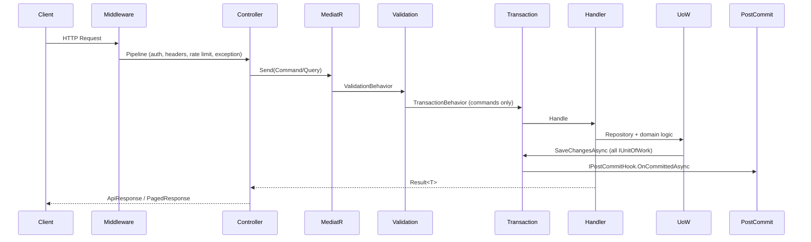

# Architecture

> English version. Vietnamese: [KIEN_TRUC.md](./KIEN_TRUC.md)

## Modular monolith

The solution is a **modular monolith**: one deployable API with clear module boundaries. Each feature module owns its Domain, Application, Infrastructure, and Api (presentation) projects. Shared cross-cutting code lives in **BuildingBlocks**.

Modules communicate through:

- MediatR commands/queries (in-process)
- Shared abstractions in BuildingBlocks
- Separate PostgreSQL schemas per module DbContext (multi-DbContext)

There are **no circular module dependencies**. Modules may reference BuildingBlocks and AuditLogs abstractions; they must not reference each other's Infrastructure directly unless already established (e.g. BackgroundJobs calling Notifications services).

## Layering

| Layer | Responsibility | Example |
|-------|----------------|---------|
| **Domain** | Entities, value objects, domain rules | `Category`, `UserRefreshToken` |
| **Application** | CQRS handlers, validators, DTOs, abstractions | `CreateCategoryCommand`, `ICategoryService` |
| **Infrastructure** | EF Core, repositories, external I/O | `CategoriesDbContext`, `CategoryService` |
| **Api** | Controllers, request/response contracts | `CategoriesController` |

BuildingBlocks provides:

- `BuildingBlocks.Domain` — base entity types
- `BuildingBlocks.Application` — Result pattern, MediatR behaviors, pagination, errors
- `BuildingBlocks.Infrastructure` — cache, health, datetime, EF helpers
- `BuildingBlocks.Web` — `BaseApiController`, middleware, `[HasPermission]`, `ApiResponse`

## Typed UnitOfWork (multi-DbContext)

Each module with persistence defines a **typed UnitOfWork** (e.g. `CategoriesUnitOfWork`) that:

1. Wraps one module `DbContext`
2. Exposes `Repository<TEntity, TKey>()`
3. Implements `IUnitOfWork` for the MediatR pipeline

Registration pattern:

```csharp
services.AddScoped<CategoriesUnitOfWork>();
services.AddScoped<IUnitOfWork>(sp => sp.GetRequiredService<CategoriesUnitOfWork>());
```

**Rule:** Module services inject the **typed** UnitOfWork (e.g. `CategoriesUnitOfWork`), not plain `IUnitOfWork`. Plain `IUnitOfWork` is only consumed by `TransactionBehavior`, which resolves **all** registered `IUnitOfWork` instances and saves each on commit.

This avoids ambiguous DbContext injection and keeps module boundaries explicit.

## Request flow



Text flow:

```
HTTP Request
  → Middleware (correlation ID, security headers, CORS, rate limit, exception handling)
  → Controller
  → MediatR Command/Query
  → LoggingBehavior
  → ValidationBehavior (FluentValidation)
  → TransactionBehavior (commands: save all UnitOfWork + post-commit hooks)
  → BusinessExceptionBehavior
  → Handler / Service
  → Repository / Typed UnitOfWork
  → SaveChanges (inside TransactionBehavior)
  → Post-commit hooks (cache flush, activity log flush, file compensation)
  → ApiResponse mapping (FromResult / FromPagedResult)
```

Queries skip `SaveChanges` unless they intentionally use a command side-effect.

**Detailed walkthrough (Users GET vs POST):** [CQRS_REQUEST_FLOW.md](./CQRS_REQUEST_FLOW.md).

## Validation pipeline

- FluentValidation validators co-located with commands/queries
- `ValidationBehavior` runs all validators before the handler
- Failures throw `ValidationException` → global handler → `400` with field errors

## TransactionBehavior

For `ICommand` / `ICommand<TResponse>`:

1. Runs handler
2. If `Result.IsFailure` → rollback hooks, no save
3. If success → `SaveChangesAsync` on **every** registered `IUnitOfWork`
4. On success → `IPostCommitHook.OnCommittedAsync` for all hooks
5. On exception → `OnRollbackAsync`, rethrow

See [POST_COMMIT_HOOKS.md](./POST_COMMIT_HOOKS.md).

## Audit & activity logging

- **Audit logs** — EF change-tracking interceptor records entity create/update/delete with before/after snapshots (configurable exclusions).
- **Activity logs** — explicit business events (login, CRUD, authorization failure) via `IActivityLogService`.
- Activity logs for request-scoped work are often **enqueued** during the handler and **flushed post-commit** so they are not written if the transaction rolls back.

## Caching

- Read-through cache in module services (categories, file metadata, email templates, notification unread count).
- Mutations enqueue cache invalidation into `ICacheOperationBuffer`.
- `CacheInvalidationPostCommitHook` applies invalidations **after** successful commit.

See [CACHING.md](./CACHING.md).

## Background jobs

Hangfire runs recurring and on-demand jobs (email retry, temp file cleanup). Job execution history is stored in `BackgroundJobs` schema. Manual triggers go through authenticated API endpoints.

See [BACKGROUND_JOBS.md](./BACKGROUND_JOBS.md).

## Error handling

- Handlers return `Result` / `Result<T>` for expected failures (not exceptions).
- Unexpected exceptions → `GlobalExceptionHandlingMiddleware` → sanitized `ApiResponse` with `traceId`.
- HTTP status derived from error code via `ResultStatusMapper`.

See [ERROR_CODES.md](./ERROR_CODES.md) and [API_CONVENTIONS.md](./API_CONVENTIONS.md).

## Module DbContexts

There is **no separate `UsersDbContext`**. The Users module (user CRUD, role/permission assignment) uses **`IdentityDbContext`** and **`IdentityUnitOfWork`** from the Identity Infrastructure project. Users is an Application/Api boundary over Identity persistence.

| Module | DbContext | Notes |
|--------|-----------|-------|
| Identity + Users | `IdentityDbContext` | Users, roles, permissions, refresh tokens, user–role mappings (`identity` schema) |
| AuditLogs | `AuditLogsDbContext` | Audit trail + activity logs |
| Categories | `CategoriesDbContext` | |
| Files | `FilesDbContext` | |
| Notifications | `NotificationsDbContext` | Notifications, email messages, templates |
| BackgroundJobs | `BackgroundJobsDbContext` | Job execution history |

Monitoring has no dedicated DbContext — it reads health/system info from runtime services.

Migrations are per DbContext; see [LOCAL_DEVELOPMENT.md](./LOCAL_DEVELOPMENT.md).
