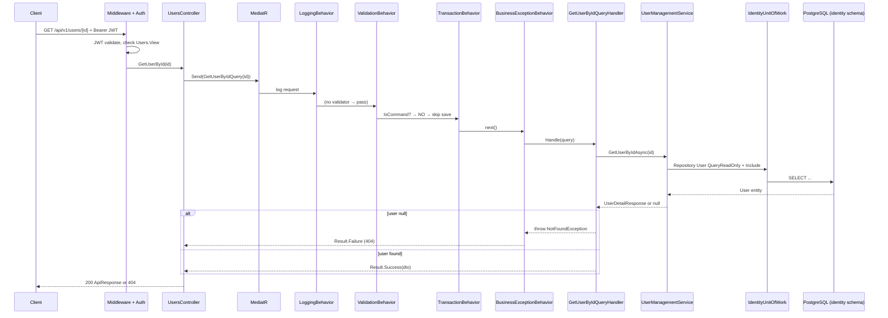
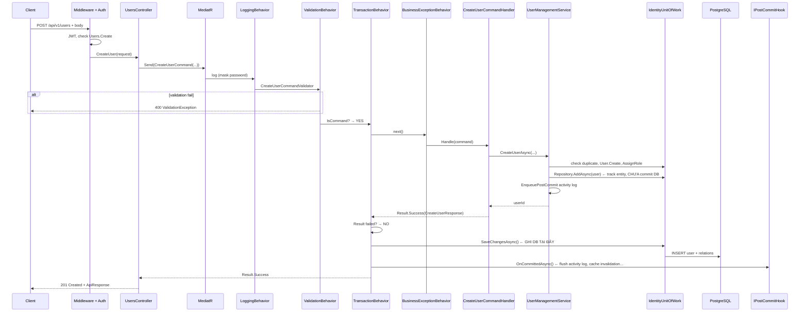

# CQRS Request Flow — Controller → MediatR → Handler → Service

> **Mục đích:** Giúp dev mới hiểu luồng xử lý request trong modular monolith — dùng **Users module** làm ví dụ chuẩn (GET read vs POST mutate). Pattern này áp dụng cho hầu hết module (Categories, MasterData, Organizations, …).

**Liên quan:** [KIEN_TRUC.md](./KIEN_TRUC.md) (tổng quan) · [POST_COMMIT_HOOKS.md](./POST_COMMIT_HOOKS.md) · [MODULE_DEVELOPMENT_GUIDE.md](./MODULE_DEVELOPMENT_GUIDE.md)

---

## Mục lục

1. [4 lớp — ai làm gì?](#1-4-lớp--ai-làm-gì)
2. [MediatR pipeline (thứ tự behavior)](#2-mediatr-pipeline-thứ-tự-behavior)
3. [Ví dụ A — GET user (Query, read-only)](#3-ví-dụ-a--get-user-query-read-only)
4. [Ví dụ B — POST create user (Command + TransactionBehavior)](#4-ví-dụ-b--post-create-user-command--transactionbehavior)
5. [Query vs Command — so sánh nhanh](#5-query-vs-command--so-sánh-nhanh)
6. [Map file Users module](#6-map-file-users-module)
7. [Checklist khi thêm use case mới](#7-checklist-khi-thêm-use-case-mới)

---

## 1. 4 lớp — ai làm gì?

| Lớp | Project | Vai trò | Biết | Không làm |
|-----|---------|---------|------|-----------|
| **Controller** | `*.Api` | Cổng HTTP: nhận request, gửi message, trả JSON/status | URL, body, `[HasPermission]`, `ApiResponse` | Query DB, business rule |
| **MediatR** | (framework) | Dispatcher: route message → đúng Handler, chạy pipeline | Type của Command/Query | Business logic |
| **Handler** | `*.Application` | 1 use case = 1 Handler: orchestration mỏng | Gọi service, wrap `Result`, rule cấp use case (404…) | Thường không EF trực tiếp |
| **Service** | `*.Infrastructure` | Logic + data: repository, mapping, rule tái sử dụng | `UnitOfWork`, entity, DTO | HTTP, MediatR |

**Analogy (nhà hàng):**

- Controller = bồi bàn (nhận order)
- MediatR = quản lý (chuyển order vào bếp đúng món)
- Handler = đầu bếp món đó (quyết xử lý use case)
- Service = bếp chính (nấu / lấy nguyên liệu = DB)

**Convention project:** Controller **không** inject service trực tiếp — luôn qua `_sender.Send(Command|Query)`.

---

## 2. MediatR pipeline (thứ tự behavior)

Đăng ký trong `BuildingBlocks.Application/DependencyInjection.cs`:

```
Send(Command|Query)
  → LoggingBehavior
  → ValidationBehavior      (FluentValidation, nếu có validator)
  → TransactionBehavior       (CHỈ Command — xem §4)
  → BusinessExceptionBehavior (BusinessException → Result.Failure)
  → Handler.Handle()
```

| Behavior | Query (GET) | Command (POST/PUT/DELETE) |
|----------|-------------|---------------------------|
| LoggingBehavior | ✅ | ✅ |
| ValidationBehavior | ✅ nếu có validator | ✅ |
| TransactionBehavior | ⏭️ **bỏ qua** | ✅ SaveChanges + post-commit |
| BusinessExceptionBehavior | ✅ | ✅ |

---

## 3. Ví dụ A — GET user (Query, read-only)

**Endpoint:** `GET /api/v1/users/{id}`  
**Permission:** `Users.View`

### Sequence diagram



### Code trace

**1. Controller** — chỉ gói query và map response:

```csharp
// Users.Api/Controllers/UsersController.cs
var result = await _sender.Send(new GetUserByIdQuery(id), cancellationToken);
return FromResult(result);
```

**2. Query + Handler** — use case mỏng:

```csharp
// Users.Application/Users/GetUserById/GetUserByIdQuery.cs
public sealed record GetUserByIdQuery(Guid Id) : IQuery<UserDetailResponse>;

// Handler:
var user = await _userManagementService.GetUserByIdAsync(request.Id, cancellationToken);
if (user is null) throw new NotFoundException(...);
return Result<UserDetailResponse>.Success(user);
```

**3. Service** — đọc DB (Users module dùng `IdentityUnitOfWork`):

```csharp
// Users.Infrastructure/Services/UserManagementService.cs
var user = await _unitOfWork.Repository<User, Guid>()
    .QueryReadOnly()
    .Include(...)
    .FirstOrDefaultAsync(u => u.Id == userId && !u.IsDeleted, cancellationToken);
return user is null ? null : MapUserDetail(user);
```

### Điểm quan trọng (GET)

- **Không** `SaveChanges` — `TransactionBehavior` detect `IQuery<>` và gọi `next()` thẳng.
- **Không** activity log enqueue (read-only).
- `NotFoundException` → `BusinessExceptionBehavior` → `Result.Failure` → HTTP **404**.

**GET list** (`GET /api/v1/users`) cùng pattern, thêm `GetUsersQueryValidator` (pageIndex, pageSize) và `FromPagedResult`.

---

## 4. Ví dụ B — POST create user (Command + TransactionBehavior)

**Endpoint:** `POST /api/v1/users`  
**Permission:** `Users.Create`

### Sequence diagram



### Code trace

**1. Controller:**

```csharp
// Users.Api/Controllers/UsersController.cs
var result = await _sender.Send(
    new CreateUserCommand(request.UserName, request.Email, ...),
    cancellationToken);
return CreatedFromResult(nameof(GetUserById), new { id = result.Data!.Id }, result);
```

**2. Command + Validator + Handler:**

```csharp
// Users.Application/Users/CreateUser/CreateUserCommand.cs
public sealed record CreateUserCommand(...) : ICommand<CreateUserResponse>;

// Validator: username, email, password policy, roleIds not null
// Handler:
var userId = await _userManagementService.CreateUserAsync(...);
return Result<CreateUserResponse>.Success(new CreateUserResponse { Id = userId });
```

**3. Service** — business + track entity, **không** gọi SaveChanges:

```csharp
// Users.Infrastructure/Services/UserManagementService.cs
// 1. Check duplicate username/email → ConflictException
// 2. Load roles, validate
// 3. User.Create(...) + AssignRole
// 4. await users.AddAsync(user)        ← EF track only
// 5. EnqueuePostCommit activity log    ← chạy sau commit
return user.Id;
```

**4. TransactionBehavior** — commit sau handler thành công:

```csharp
// BuildingBlocks.Application/Behaviors/TransactionBehavior.cs
if (!IsCommand()) return await next();           // Query → skip

var response = await next();                     // chạy Handler + Service
if (ResultReflection.IsFailedResult(response))   // fail → không save
    return response;

foreach (var unitOfWork in _unitOfWorks)
    await unitOfWork.SaveChangesAsync();         // ← COMMIT DB

await CommitPostCommitHooksAsync();              // activity log, cache, ...
return response;
```

### Điểm quan trọng (POST)

| Việc | Ai làm | Khi nào |
|------|--------|---------|
| Validate input | `CreateUserCommandValidator` + `ValidationBehavior` | Trước handler |
| Business rule (duplicate, …) | `UserManagementService` | Trong handler, trước save |
| `AddAsync` / mutate entity | Service qua Repository | Trong handler |
| **`SaveChangesAsync`** | **`TransactionBehavior`** | **Sau** handler return Success |
| Activity log ghi DB | `IPostCommitHook` (flush queue) | **Sau** commit |
| EF Audit interceptor | EF change tracking | Trong SaveChanges |

**Quy tắc bắt buộc:** Service/repository **không** gọi `SaveChanges` — để `TransactionBehavior` commit thống nhất (multi-DbContext nếu có nhiều `IUnitOfWork`).

**Lỗi thường gặp:**

- Duplicate username → `ConflictException` → `BusinessExceptionBehavior` → **409**
- Validation fail → **400** (trước khi vào handler)
- `SaveChanges` fail → exception → rollback hooks → **500**

---

## 5. Query vs Command — so sánh nhanh

| | **Query (GET)** | **Command (POST/PUT/PATCH/DELETE)** |
|--|-----------------|-------------------------------------|
| Interface | `IQuery<TResponse>` | `ICommand` / `ICommand<TResponse>` |
| Ví dụ Users | `GetUserByIdQuery`, `GetUsersQuery` | `CreateUserCommand`, `UpdateUserCommand` |
| Handler trả về | `Result<T>` | `Result` / `Result<T>` |
| ValidationBehavior | Có (nếu có validator) | Có |
| TransactionBehavior | **Skip** | **SaveChanges + post-commit** |
| Service ghi DB | Chỉ `QueryReadOnly` | `Add/Update` + track entity |
| Activity log | Không | Enqueue post-commit (mutations) |
| HTTP response | `FromResult` / `FromPagedResult` | `FromResult` / `CreatedFromResult` |

---

## 6. Map file Users module

```
src/Modules/Users/
├── Users.Api/
│   ├── Controllers/UsersController.cs      ← HTTP entry
│   └── Contracts/CreateUserRequest.cs      ← API DTO (request body)
├── Users.Application/
│   ├── Users/GetUserById/
│   │   ├── GetUserByIdQuery.cs             ← Query + Handler
│   │   └── UserDetailResponse.cs           ← Application DTO
│   ├── Users/GetUsers/
│   │   └── GetUsersQuery.cs                ← Query + Validator + Handler
│   ├── Users/CreateUser/
│   │   └── CreateUserCommand.cs            ← Command + Validator + Handler
│   └── Abstractions/IUserManagementService.cs
└── Users.Infrastructure/
    ├── Services/UserManagementService.cs   ← Service implementation
    └── DependencyInjection.cs              ← IUserManagementService → impl

Identity entities (User, Role) nằm ở:
  src/Modules/Identity/Identity.Infrastructure/Persistence/IdentityDbContext.cs
Users module đọc/ghi qua IdentityUnitOfWork (cross-module data, không duplicate User entity).
```

**ApiHost wiring:**

- `AddApplicationServices` → đăng ký MediatR + validators từ `Users.Application`
- `AddUsersInfrastructure` → `IUserManagementService`
- `AddUsersPresentation` → discover `UsersController`

---

## 7. Checklist khi thêm use case mới

**Read (Query):**

- [ ] `XxxQuery` implements `IQuery<TResponse>`
- [ ] `XxxQueryHandler` inject `IXxxService`, return `Result<T>`
- [ ] Validator (nếu có filter/paging rules)
- [ ] Controller: `[HasPermission(View)]` + `_sender.Send` + `FromResult`/`FromPagedResult`
- [ ] Service: `QueryReadOnly()`, không SaveChanges

**Write (Command):**

- [ ] `XxxCommand` implements `ICommand` / `ICommand<T>`
- [ ] `XxxCommandValidator` (FluentValidation)
- [ ] Handler gọi service, return `Result`
- [ ] Service: mutate entity qua repository, **không** SaveChanges
- [ ] Activity log / cache invalidation qua post-commit nếu cần
- [ ] Module `UnitOfWork` registered as `IUnitOfWork` cho TransactionBehavior
- [ ] Controller: `[HasPermission(Manage/Create/...)]` + `FromResult`/`CreatedFromResult`

---

## Tóm tắt một dòng

> **Controller** gửi message → **MediatR** chạy pipeline → **Handler** điều phối use case → **Service** làm việc với DB; **Command** thêm bước **TransactionBehavior** commit + post-commit, **Query** thì không.
