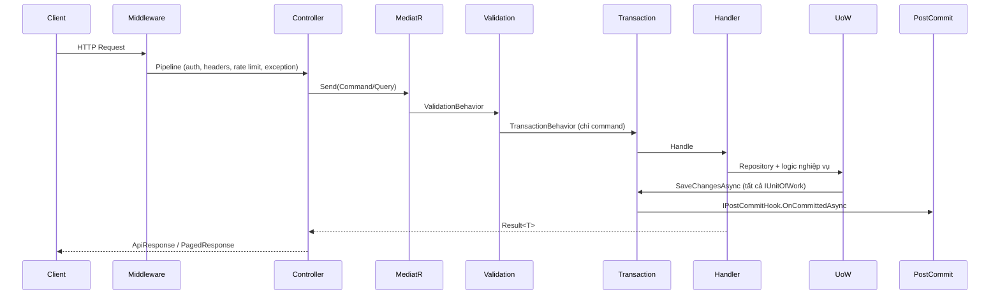

# Kiến trúc hệ thống

> Bản tiếng Việt của [ARCHITECTURE.md](./ARCHITECTURE.md). Nội dung hai file được đồng bộ về mặt kỹ thuật; file này ưu tiên diễn giải bằng tiếng Việt cho team nội bộ.

Xem thêm cấu trúc source chi tiết: [TECHNICAL_ARCHITECTURE.md](./TECHNICAL_ARCHITECTURE.md).

---

## Modular monolith

Solution là **modular monolith**: một API deploy duy nhất, nhưng ranh giới module rõ ràng. Mỗi feature module sở hữu các project Domain, Application, Infrastructure và Api (presentation) riêng. Code dùng chung (cross-cutting) nằm trong **BuildingBlocks**.

Các module giao tiếp qua:

- MediatR commands/queries (in-process, cùng process)
- Abstraction dùng chung trong BuildingBlocks
- Schema PostgreSQL riêng cho từng `DbContext` (multi-DbContext)

**Không có phụ thuộc vòng** giữa các module. Module được phép reference BuildingBlocks và abstraction của AuditLogs; **không** được reference trực tiếp Infrastructure của module khác, trừ pattern đã thiết lập sẵn (ví dụ BackgroundJobs gọi service của Notifications).

---

## Phân tầng (Layering)

| Tầng | Trách nhiệm | Ví dụ |
|------|-------------|-------|
| **Domain** | Entity, value object, quy tắc nghiệp vụ | `Category`, `UserRefreshToken` |
| **Application** | CQRS handler, validator, DTO, abstraction | `CreateCategoryCommand`, `ICategoryService` |
| **Infrastructure** | EF Core, repository, I/O bên ngoài | `CategoriesDbContext`, `CategoryService` |
| **Api** | Controller, contract request/response | `CategoriesController` |

BuildingBlocks cung cấp:

- `BuildingBlocks.Domain` — base entity
- `BuildingBlocks.Application` — Result pattern, MediatR behaviors, pagination, error codes
- `BuildingBlocks.Infrastructure` — cache, health, datetime, EF helpers
- `BuildingBlocks.Web` — `BaseApiController`, middleware, `[HasPermission]`, `ApiResponse`

---

## Typed UnitOfWork (multi-DbContext)

Mỗi module có persistence định nghĩa **typed UnitOfWork** (ví dụ `CategoriesUnitOfWork`) với vai trò:

1. Bọc (wrap) một `DbContext` của module
2. Expose `Repository<TEntity, TKey>()`
3. Implement `IUnitOfWork` cho MediatR pipeline

Pattern đăng ký DI:

```csharp
services.AddScoped<CategoriesUnitOfWork>();
services.AddScoped<IUnitOfWork>(sp => sp.GetRequiredService<CategoriesUnitOfWork>());
```

**Quy tắc:** Service trong module inject **typed** UnitOfWork (ví dụ `CategoriesUnitOfWork`), **không** inject plain `IUnitOfWork`. Plain `IUnitOfWork` chỉ được `TransactionBehavior` consume — behavior này resolve **tất cả** instance `IUnitOfWork` đã đăng ký và gọi `SaveChangesAsync` trên từng instance khi commit.

Cách này tránh inject nhầm DbContext và giữ ranh giới module rõ ràng.

---

## Luồng xử lý request



Luồng dạng text:

```
HTTP Request
  → Middleware (correlation ID, security headers, CORS, rate limit, xử lý exception)
  → Controller
  → MediatR Command/Query
  → LoggingBehavior
  → ValidationBehavior (FluentValidation)
  → TransactionBehavior (command: save tất cả UnitOfWork + post-commit hooks)
  → BusinessExceptionBehavior
  → Handler / Service
  → Repository / Typed UnitOfWork
  → SaveChanges (bên trong TransactionBehavior)
  → Post-commit hooks (flush cache, flush activity log, file compensation)
  → Map ApiResponse (FromResult / FromPagedResult)
```

**Query** bỏ qua bước `SaveChanges`, trừ khi cố ý có side-effect ghi dữ liệu.

---

## Pipeline validation

- FluentValidation validator đặt cùng folder với command/query
- `ValidationBehavior` chạy tất cả validator **trước** handler
- Lỗi validation → `ValidationException` → global handler → HTTP **400** kèm lỗi theo field

---

## TransactionBehavior

Áp dụng cho `ICommand` / `ICommand<TResponse>`:

1. Chạy handler
2. Nếu `Result.IsFailure` → gọi rollback hooks, **không** save
3. Nếu thành công → `SaveChangesAsync` trên **mọi** `IUnitOfWork` đã đăng ký
4. Sau commit thành công → `IPostCommitHook.OnCommittedAsync` cho tất cả hooks
5. Nếu exception → `OnRollbackAsync`, rethrow

Chi tiết hook: [POST_COMMIT_HOOKS.md](./POST_COMMIT_HOOKS.md).

---

## Audit log & Activity log

- **Audit log** — EF change-tracking interceptor ghi create/update/delete entity kèm snapshot before/after (có thể loại trừ field nhạy cảm).
- **Activity log** — sự kiện nghiệp vụ/bảo mật tường minh (login, CRUD, authorization failure) qua `IActivityLogService`.
- Activity log trong scope request thường được **enqueue** trong handler và **flush sau commit** — nếu transaction rollback thì không ghi log.

---

## Cache

- Read-through cache trong module service (categories, file metadata, email template, unread notification count…).
- Thao tác ghi (mutation) enqueue cache invalidation vào `ICacheOperationBuffer`.
- `CacheInvalidationPostCommitHook` áp dụng invalidation **sau** commit thành công.

Chi tiết: [CACHING.md](./CACHING.md).

---

## Background jobs

Hangfire chạy job định kỳ và theo yêu cầu (email retry, dọn file tạm…). Lịch sử thực thi lưu trong schema `background_jobs`. Trigger thủ công qua API có xác thực.

Chi tiết: [BACKGROUND_JOBS.md](./BACKGROUND_JOBS.md).

---

## Xử lý lỗi

- Handler trả `Result` / `Result<T>` cho lỗi **dự kiến** (không ném exception).
- Exception không mong đợi → `GlobalExceptionHandlingMiddleware` → `ApiResponse` đã sanitize kèm `traceId`.
- HTTP status map từ error code qua `ResultStatusMapper`.

Chi tiết: [ERROR_CODES.md](./ERROR_CODES.md), [API_CONVENTIONS.md](./API_CONVENTIONS.md).

---

## DbContext theo module

**Không có `UsersDbContext` riêng.** Module Users (CRUD user, gán role/permission) dùng **`IdentityDbContext`** và **`IdentityUnitOfWork`** từ project Identity Infrastructure. Users là lớp Application/Api trên persistence của Identity.

| Module | DbContext | Ghi chú |
|--------|-----------|---------|
| Identity + Users | `IdentityDbContext` | User, role, permission, refresh token, mapping user–role (schema `identity`) |
| AuditLogs | `AuditLogsDbContext` | Audit trail + activity log |
| Categories | `CategoriesDbContext` | |
| Files | `FilesDbContext` | |
| Notifications | `NotificationsDbContext` | Notification, email message, template |
| BackgroundJobs | `BackgroundJobsDbContext` | Lịch sử chạy job |

Monitoring **không** có DbContext riêng — đọc health/system info từ runtime services.

Migration theo từng DbContext: [LOCAL_DEVELOPMENT.md](./LOCAL_DEVELOPMENT.md).

---

## Tài liệu liên quan

| Chủ đề | File |
|--------|------|
| Cấu trúc source đầy đủ | [TECHNICAL_ARCHITECTURE.md](./TECHNICAL_ARCHITECTURE.md) |
| Bản tiếng Anh (cùng nội dung) | [ARCHITECTURE.md](./ARCHITECTURE.md) |
| Module overview | [MODULES.md](./MODULES.md) |
| Tạo module mới | [MODULE_DEVELOPMENT_GUIDE.md](./MODULE_DEVELOPMENT_GUIDE.md) |
| Quy chuẩn business module | [BUSINESS_MODULE_RULES.md](./BUSINESS_MODULE_RULES.md) |
