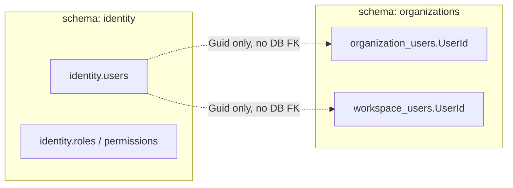

# Organizations Module

Phase 23 foundation for tenant, organization hierarchy, workspace, and user membership.

## Purpose

- Manage **tenants** (multi-tenant boundary without global EF filters in this phase)
- Manage **organizations** (hierarchical tree per tenant)
- Assign **organization membership** for identity users
- Manage **workspaces** scoped to tenant (optional organization link)
- Assign **workspace membership** with organization-membership validation when required

## Schema

PostgreSQL schema: `organizations`

| Table | Entity |
|-------|--------|
| `organizations.tenants` | `Tenant` |
| `organizations.organizations` | `Organization` |
| `organizations.organization_users` | `OrganizationUser` |
| `organizations.workspaces` | `Workspace` |
| `organizations.workspace_users` | `WorkspaceUser` |

Migration: `AddOrganizationTenantWorkspaceModule`

## Data model & relationships

This section describes how tables relate within the `organizations` schema, how the module connects to Identity, and how the layers fit together from a reader's perspective.

### PostgreSQL schema vs. module boundary

The application uses **one PostgreSQL database** (for example `modular_monolith_dev`), but each module owns a **separate schema** (namespace):

```
PostgreSQL Database
├── identity.*          ← Identity module (users, roles, permissions, JWT, …)
├── organizations.*     ← Organizations module (this document)
├── settings.*          ← Settings module
├── audit_logs.*        ← Audit logs module
└── …
```

The Organizations module owns only the `organizations` schema. Tables in other schemas are not modified by Organizations migrations (`OrganizationsDbContext`).

| Table | Role |
|-------|------|
| `organizations.tenants` | **Tenant** — multi-tenant boundary (top of the hierarchy) |
| `organizations.organizations` | **Organization** — hierarchical tree inside a tenant |
| `organizations.organization_users` | Which Identity user belongs to which organization |
| `organizations.workspaces` | **Workspace** — working context scoped to a tenant |
| `organizations.workspace_users` | Which Identity user belongs to which workspace |

There is **no database foreign key** from `organizations.*` to `identity.users`. Columns named `UserId` store a `Guid` that matches `identity.users.Id`; existence is validated at runtime via `IIdentityUserRepository`. This keeps modules loosely coupled while sharing one database.

### Entity-relationship diagram (within `organizations`)

All foreign keys inside this schema use `ON DELETE RESTRICT` — PostgreSQL blocks hard deletes when dependent rows exist. The application uses soft delete and dependency checks before deactivate/delete.

```mermaid
erDiagram
    TENANTS ||--o{ ORGANIZATIONS : "TenantId"
    ORGANIZATIONS ||--o{ ORGANIZATIONS : "ParentOrganizationId (self)"
    TENANTS ||--o{ ORGANIZATION_USERS : "TenantId"
    ORGANIZATIONS ||--o{ ORGANIZATION_USERS : "OrganizationId"
    TENANTS ||--o{ WORKSPACES : "TenantId"
    ORGANIZATIONS ||--o{ WORKSPACES : "OrganizationId (optional)"
    TENANTS ||--o{ WORKSPACE_USERS : "TenantId"
    WORKSPACES ||--o{ WORKSPACE_USERS : "WorkspaceId"

    IDENTITY_USERS ||..o{ ORGANIZATION_USERS : "UserId (logical, no FK)"
    IDENTITY_USERS ||..o{ WORKSPACE_USERS : "UserId (logical, no FK)"

    TENANTS {
        uuid Id PK
        string Code UK
        string Name
        bool IsActive
    }
    ORGANIZATIONS {
        uuid Id PK
        uuid TenantId FK
        uuid ParentOrganizationId FK_nullable
        string Code
        string Type
    }
    ORGANIZATION_USERS {
        uuid Id PK
        uuid TenantId FK
        uuid OrganizationId FK
        uuid UserId
        bool IsDefault
    }
    WORKSPACES {
        uuid Id PK
        uuid TenantId FK
        uuid OrganizationId FK_nullable
        string Code
    }
    WORKSPACE_USERS {
        uuid Id PK
        uuid TenantId FK
        uuid WorkspaceId FK
        uuid UserId
    }
```

### Layer-by-layer meaning (top → bottom)

#### Tenant — “customer / company boundary”

The **root** of the hierarchy. Every organization, workspace, and membership row belongs to exactly one tenant.

- `Code` is unique among non-deleted tenants (for example `DEMO`).
- One Identity user can belong to **multiple tenants** via separate rows in `organization_users` / `workspace_users` with different `TenantId` values.

#### Organization — internal hierarchy

A **tree per tenant**, typically company → division → department:

```
Tenant: DEMO
└── HQ (Company)                    ← ParentOrganizationId = null
    ├── IT (Department)
    └── SALES (Department)
```

- `ParentOrganizationId` is a self-reference on `organizations.organizations`.
- `Type` enum: `Company`, `Division`, `Department`, `Branch`, `Team`, `Other`.
- `Code` is unique **per tenant**: index on `(TenantId, Code)` where `is_deleted = false`.

#### OrganizationUser — “which org does this user belong to?”

A **join table** linking an Identity user to an organization within a tenant:

```
User admin ──► Organization HQ (tenant DEMO, IsDefault = true)
User admin ──► Organization IT  (tenant DEMO, IsDefault = false)
```

- `TenantId` is duplicated on the row (denormalized) for filtering and constraints.
- At most one active row per `(OrganizationId, UserId)`.
- At most one row with `IsDefault = true` per `(TenantId, UserId)`.

#### Workspace — working / project space

A workspace always belongs to a tenant. It may optionally link to one organization:

```
Tenant DEMO
├── Workspace MAIN  → OrganizationId = HQ
└── Workspace LAB   → OrganizationId = null (tenant-wide workspace)
```

Use cases: a team workspace tied to a department, or a shared workspace with no org link.

#### WorkspaceUser — “who can access this workspace?”

A **join table** linking an Identity user to a workspace.

Important rule: if the workspace has `OrganizationId` set, the user must already have an **active** row in `organization_users` for that organization before they can be added to the workspace.

### Link to Identity (cross-schema, logical only)



| Concern | Organizations | Identity |
|---------|---------------|----------|
| Login, JWT, password | No | Yes |
| User exists and is active | Validated via repository | Yes |
| User belongs to org / workspace | Yes | No |
| API permissions (`Tenant.View`, …) | Permission codes used by controllers | Seeded and enforced here |

Both modules use the same connection string but run **independent EF migrations** (`OrganizationsDbContext` vs `IdentityDbContext`).

### Example: demo seed data wired together

After `IOrganizationsSeeder` runs (see [Demo seed data](#demo-seed-data)):

```
identity.users
  └── admin (Guid = …)

organizations.tenants
  └── DEMO

organizations.organizations
  └── HQ (TenantId = DEMO, Parent = null, Type = Company)

organizations.workspaces
  └── MAIN (TenantId = DEMO, OrganizationId = HQ)

organizations.organization_users
  └── (TenantId = DEMO, OrganizationId = HQ, UserId = admin, IsDefault = true)

organizations.workspace_users
  └── (TenantId = DEMO, WorkspaceId = MAIN, UserId = admin)
```

Reading order for new developers:

1. **Tenant** — data isolation boundary  
2. **Organization** — company structure  
3. **OrganizationUser** — user’s place in that structure  
4. **Workspace** — where work happens  
5. **WorkspaceUser** — who may enter that workspace  

### Database constraints (summary)

| Constraint | Meaning |
|------------|---------|
| `(TenantId, Code)` unique on `organizations`, `workspaces` | Codes do not collide within the same tenant |
| `(OrganizationId, UserId)` unique on `organization_users` | One membership row per user per organization |
| `(TenantId, UserId)` + `IsDefault = true` unique | One default organization per user per tenant |
| `(WorkspaceId, UserId)` unique on `workspace_users` | One membership row per user per workspace |
| `ON DELETE RESTRICT` on all FKs | Cannot hard-delete parent while children exist; app checks before soft delete / deactivate |

### Phase 23 vs Phase 24+

**Phase 23 (Organizations module):**

- Full CRUD APIs and persistence model are in place.
- No global EF filter that automatically scopes every query to the current tenant.

**Phase 24 / 24.1 (Authorization Policies — implemented):**

- Scoped authorization foundation: permission policies, role assignments, user overrides, authorization matrix.
- Evaluator (`IAuthorizationMatrixService`) checks tenant/org/workspace membership via `IOrganizationUserService` / `IWorkspaceUserService`.
- **Organizations CRUD APIs are not yet wired** to the evaluator — callers still use JWT `[HasPermission]` only; scope enforcement is opt-in per business module via `CheckAsync` / `AuthorizeAsync`.
- No global tenant EF filter (by design).

See [AUTHORIZATION_POLICIES.md](./AUTHORIZATION_POLICIES.md) and [Future / backlog](#future--backlog).

## Permissions

| Permission | Usage |
|------------|--------|
| `Tenant.View` | GET tenants |
| `Tenant.Manage` | Create/update/delete/activate/deactivate tenants |
| `Organization.View` | GET organizations, organization-users |
| `Organization.Manage` | Mutations on organizations and organization-users |
| `Workspace.View` | GET workspaces, workspace-users |
| `Workspace.Manage` | Mutations on workspaces and workspace-users |

Seeded via `PermissionCodes.All` in Identity seeder.

## Demo seed data

When `OrganizationsSeed:Enabled` is `true` (default in local/dev) and `Database:ApplyMigrationsOnStartup` is `true`, `IOrganizationsSeeder` runs after the Organizations migration. The seeder is **idempotent** — if tenant code `DEMO` already exists, nothing is inserted.

| Entity | Code | Name |
|--------|------|------|
| Tenant | `DEMO` | Demo Tenant |
| Organization | `HQ` | Demo Company (root, type `Company`) |
| Workspace | `MAIN` | Main Workspace (linked to `HQ`) |

If the admin user from `AdminSeed:UserName` (default `admin`) exists, it is also assigned as default organization member and workspace member for the demo tenant.

Set `OrganizationsSeed:Enabled` to `false` in Production (see `appsettings.Production.json`).

## API

| Prefix | Controller |
|--------|------------|
| `/api/v1/tenants` | `TenantsController` |
| `/api/v1/organizations` | `OrganizationsController` |
| `/api/v1/organization-users` | `OrganizationUsersController` |
| `/api/v1/workspaces` | `WorkspacesController` |
| `/api/v1/workspace-users` | `WorkspaceUsersController` |

See [API-DOCUMENT.md](./API-DOCUMENT.md) for the full endpoint list.

## Business rules (summary)

### Tenant

- Code required, normalized uppercase, unique among non-deleted rows
- Soft delete
- Cannot delete/deactivate while active organizations, workspaces, or organization memberships exist

### Organization

- Belongs to tenant; code unique per tenant (non-deleted)
- Optional parent (self-reference); prevents self-parent and circular chains
- Cannot create/activate under inactive tenant or inactive parent
- Cannot delete/deactivate while active children, workspaces, or memberships exist

### OrganizationUser

- Links tenant + organization + identity `UserId` (no cross-schema FK to identity)
- User validated via `IIdentityUserRepository`
- Unique organization + user (non-deleted)
- At most one `IsDefault = true` per user per tenant
- Cannot assign to inactive tenant/organization

### Workspace

- Belongs to tenant; code unique per tenant (non-deleted)
- Optional organization must belong to same tenant
- Cannot delete/deactivate while active workspace users exist

### WorkspaceUser

- Links tenant + workspace + identity `UserId`
- If workspace has `OrganizationId`, user must have active organization membership for that organization
- Unique workspace + user (non-deleted)

## Activity & audit logs

- **Activity log:** post-commit via `EnqueuePostCommitAsync` with `AuditLogConstants.Modules.Organizations`
- **Audit log:** automatic EF change tracking for all entities (module resolved in `AuditChangeTrackingInterceptor`)

## Identity integration

Summary of the cross-schema link (full diagrams and tables in [Data model & relationships](#data-model--relationships)):

- `UserId` is a `Guid` matching Identity user id.
- No FK to `identity.users` — existence validated through `IIdentityUserRepository.FindActiveByIdForUpdateAsync`.
- No breaking changes to the Identity module.

## Future / backlog

- Wire Organizations API handlers to `IAuthorizationMatrixService` for scoped access (Phase 25+)
- Global tenant query filters (explicitly out of scope)
- Tenant-level settings and quotas

## Tests

`Organizations.Infrastructure.Tests` — 21 smoke tests covering duplicate codes, hierarchy, membership, defaults, inactive guards, and dependency checks.

## Migration command

```bash
dotnet ef migrations add AddOrganizationTenantWorkspaceModule \
  --project src/Modules/Organizations/Organizations.Infrastructure \
  --startup-project src/ApiHost \
  --context OrganizationsDbContext

dotnet ef database update \
  --project src/Modules/Organizations/Organizations.Infrastructure \
  --startup-project src/ApiHost \
  --context OrganizationsDbContext
```
