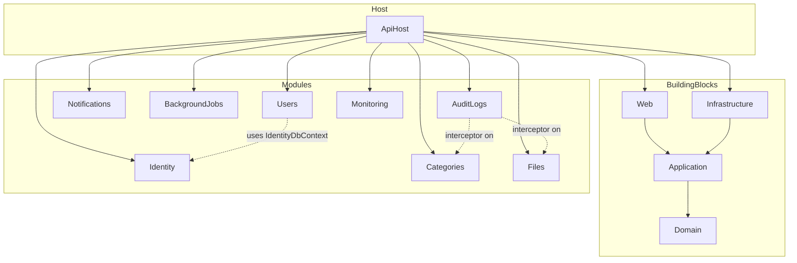

# Technical Architecture (TA)

> **Mục đích:** Tài liệu kỹ thuật tổng quan — giúp developer mới onboard nhanh, hiểu cấu trúc source, vai trò từng folder/file, và biết đọc tiếp tài liệu nào khi implement feature.

**Phiên bản stack:** .NET 8 · PostgreSQL · Redis (optional) · Hangfire · JWT · MediatR · FluentValidation · EF Core 8

**Solution:** `ModularMonolith.sln` — **50 projects** (37 production + 13 test)

---

## Mục lục

1. [Tổng quan kiến trúc](#1-tổng-quan-kiến-trúc)
2. [Cấu trúc repository (root)](#2-cấu-trúc-repository-root)
3. [Solution & dependency map](#3-solution--dependency-map)
4. [ApiHost — composition root](#4-apihost--composition-root)
5. [BuildingBlocks — shared foundation](#5-buildingblocks--shared-foundation)
6. [Chuẩn cấu trúc module](#6-chuẩn-cấu-trúc-module)
7. [Chi tiết từng module](#7-chi-tiết-từng-module)
8. [Database & schema map](#8-database--schema-map)
9. [Request pipeline & middleware](#9-request-pipeline--middleware)
10. [Configuration & secrets](#10-configuration--secrets)
11. [Testing layout](#11-testing-layout)
12. [Documentation & AI workspace](#12-documentation--ai-workspace)
13. [Scripts & DevOps](#13-scripts--devops)
14. [Onboarding checklist](#14-onboarding-checklist)

---

## 1. Tổng quan kiến trúc

### 1.1 Modular Monolith

Ứng dụng là **modular monolith**: một process deploy duy nhất (`ApiHost`), nhưng code được chia thành **module độc lập** theo bounded context. Mỗi module sở hữu Domain / Application / Infrastructure / Api riêng.

```
┌─────────────────────────────────────────────────────────────┐
│                        ApiHost                              │
│  Program.cs · middleware · Swagger · Hangfire dashboard     │
└──────────────────────────┬──────────────────────────────────┘
                           │ references
     ┌─────────────────────┼─────────────────────┐
     ▼                     ▼                     ▼
 BuildingBlocks        Feature Modules      Cross-cutting
 (shared libs)    Identity, Users, Categories…   AuditLogs
```

**Nguyên tắc:**

| Nguyên tắc | Mô tả |
|------------|--------|
| **Không phụ thuộc vòng** | Module A không reference Infrastructure của Module B (trừ pattern đã thiết lập, ví dụ BackgroundJobs gọi Notifications) |
| **CQRS in-process** | Command/Query qua MediatR trong cùng process |
| **Multi-DbContext** | Mỗi module có schema PostgreSQL riêng; `TransactionBehavior` commit tất cả `IUnitOfWork` đã đăng ký |
| **Result pattern** | Handler trả `Result<T>`; controller map qua `BaseApiController` |
| **Permission-based auth** | JWT + RBAC; policy động qua `[HasPermission]` |

Chi tiết request flow: [KIEN_TRUC.md](./KIEN_TRUC.md) (Tiếng Việt) · [ARCHITECTURE.md](./ARCHITECTURE.md) (English).

### 1.2 Tech stack

| Thành phần | Công nghệ |
|------------|-----------|
| Runtime | .NET 8, ASP.NET Core Web API |
| ORM | Entity Framework Core 8 + Npgsql |
| CQRS | MediatR 12 |
| Validation | FluentValidation 11 |
| Auth | JWT Bearer + refresh token rotation |
| Cache | Memory hoặc Redis |
| Background jobs | Hangfire (PostgreSQL storage) |
| Logging | Serilog |
| API docs | Swashbuckle (Swagger) |
| Tests | xUnit, WebApplicationFactory (integration) |

---

## 2. Cấu trúc repository (root)

```
WebApplication/
├── ModularMonolith.sln      # Solution chính (50 projects)
├── README.md                # Entry point — link docs/
├── DOCKER.md                # Docker Compose stack
├── CI.md                    # GitHub Actions
├── TESTING.md               # Baseline test (151 passed, 4 skipped)
├── SECRETS.md               # Quản lý secret local/production
├── SECURITY.md              # Hardening production
├── PRODUCTION.md            # Deploy production
├── .env.example             # Template biến môi trường Docker
├── docker-compose.yml       # PostgreSQL, Redis, Mailpit, API
├── Dockerfile               # Build image ApiHost
├── scripts/                 # dev-up/down, migrations, tests, smoke
├── docs/                    # Developer documentation (đầy đủ)
├── ai/                      # AI workspace — rules, prompts, checklists
├── .cursor/rules/           # Cursor wiring (*.mdc → ai/rules/*.md)
└── src/                     # Toàn bộ source code
    ├── ApiHost/
    ├── BuildingBlocks/
    └── Modules/
```

| Path | Vai trò |
|------|---------|
| `docs/` | Tài liệu developer đầy đủ (architecture, API, module guides, business rules) |
| `ai/` | Hub cho Cursor/AI: rules nội dung, prompts, checklists, references |
| `.cursor/rules/` | Stub `.mdc` — Cursor chỉ auto-load rules từ đây; nội dung thật ở `ai/rules/` |
| `scripts/` | Automation local: Docker, EF migrations, test runner |
| `src/` | Production code — **không commit** `bin/`, `obj/` |

---

## 3. Solution & dependency map

### 3.1 Nhóm project

| Nhóm | Projects | Số lượng |
|------|----------|----------|
| **ApiHost** | `ApiHost`, `ApiHost.IntegrationTests` | 2 |
| **BuildingBlocks** | Domain, Application, Infrastructure, Web, Testing + 3 test projects | 8 |
| **Identity** | Domain, Application, Infrastructure, Api + Application.Tests | 5 |
| **Users** | Domain, Application, Infrastructure, Api | 4 |
| **Categories** | Domain, Application, Infrastructure, Api + Infrastructure.Tests | 5 |
| **Files** | Domain, Application, Infrastructure, Api + Application.Tests + Infrastructure.Tests | 6 |
| **Notifications** | Domain, Application, Infrastructure, Api + Application.Tests + Infrastructure.Tests | 6 |
| **BackgroundJobs** | Domain, Application, Infrastructure, Api + Application.Tests + Infrastructure.Tests | 6 |
| **AuditLogs** | Domain, Application, Infrastructure, Api | 4 |
| **Monitoring** | Application, Infrastructure, Api + Infrastructure.Tests | 4 |
| **Tổng** | | **50** |

### 3.2 Dependency giữa các layer (chuẩn module)

```
Module.Api
  └── Module.Application
        └── Module.Domain
              └── BuildingBlocks.Domain

Module.Infrastructure
  └── Module.Application
        └── BuildingBlocks.Infrastructure
              └── BuildingBlocks.Application

ApiHost
  └── Module.Api + Module.Infrastructure + BuildingBlocks.Web
```

**Quy tắc reference:**

- `Domain` — chỉ reference `BuildingBlocks.Domain` (entities, events, exceptions)
- `Application` — CQRS, validators, abstractions; **không** reference EF/Infrastructure
- `Infrastructure` — EF, repositories, external I/O, DI registration
- `Api` — controllers, request contracts; reference Application (+ Web cho base controller)

### 3.3 ApiHost references (composition)

`ApiHost.csproj` reference trực tiếp:

- `BuildingBlocks.Web`, `BuildingBlocks.Infrastructure`
- Mỗi module: `*.Api` + `*.Infrastructure` (không reference Application trực tiếp — MediatR scan qua DI)

MediatR assemblies được đăng ký trong `ServiceCollectionExtensions.AddApplicationServices`:

```csharp
// src/ApiHost/Extensions/ServiceCollectionExtensions.cs
AddBuildingBlocksApplication(configuration,
    typeof(Program).Assembly,
    typeof(Identity.Application.DependencyInjection).Assembly,
    typeof(Users.Application.DependencyInjection).Assembly,
    typeof(AuditLogs.Application.DependencyInjection).Assembly,
    typeof(Categories.Application.DependencyInjection).Assembly,
    typeof(Files.Application.DependencyInjection).Assembly,
    typeof(Notifications.Application.DependencyInjection).Assembly,
    typeof(BackgroundJobs.Application.DependencyInjection).Assembly,
    typeof(Monitoring.Application.DependencyInjection).Assembly);
```

---

## 4. ApiHost — composition root

**Path:** `src/ApiHost/`

ApiHost là **điểm vào duy nhất** của ứng dụng. Không chứa business logic — chỉ wiring, middleware host-level, config.

### 4.1 File map

| File / Folder | Chức năng |
|---------------|-----------|
| `Program.cs` | Bootstrap: DI, middleware pipeline, migrations, Hangfire, health, Swagger |
| `Extensions/ServiceCollectionExtensions.cs` | MediatR scan, Swagger, BuildingBlocks registration |
| `Extensions/SecurityServiceExtensions.cs` | CORS, rate limiting, security headers, upload limits |
| `Extensions/MiddlewareExtensions.cs` | Correlation ID, request logging, global exception |
| `Startup/ProductionStartupValidator.cs` | Validate config bắt buộc khi Production (Redis, connection string, admin seed) |
| `Startup/DatabaseMigrationStartup.cs` | Auto-apply EF migrations + seed khi `Database:ApplyMigrationsOnStartup=true` |
| `Middlewares/CorrelationIdMiddleware.cs` | Gán/propagate `X-Correlation-Id` |
| `Middlewares/RequestResponseLoggingMiddleware.cs` | Log request/response (mask sensitive headers) |
| `appsettings.json` | Config mặc định (cache, rate limit, health, JWT sections…) |
| `appsettings.Development.json` | Override dev (Swagger, logging chi tiết) |
| `appsettings.Docker.json` | Override Docker Compose |
| `appsettings.Production.json` | Override production |
| `appsettings.IntegrationTesting.json` | Config cho integration tests |
| `ApiHost.IntegrationTests/` | End-to-end tests qua `WebApplicationFactory` |

### 4.2 Startup sequence (`Program.cs`)

```
1. ProductionStartupValidator.Validate()
2. Serilog bootstrap (skip IntegrationTesting)
3. AddApplicationServices()      → MediatR + validators + behaviors
4. AddInfrastructureServices()  → BuildingBlocks infra (cache, health, datetime)
5. AddBuildingBlocksWeb()       → CurrentUser, correlation, authorization handlers
6. AddApiSecurityServices()     → CORS, rate limit, security headers
7. Add*Infrastructure() × modules
8. Add*Api() × modules
9. AddIdentityAuthentication()
10. AddControllers().Add*Presentation() × modules
11. AddAuthorization() + AddSwaggerServices()
12. Build app
13. DatabaseMigrationStartup (optional)
14. RegisterBackgroundJobsRecurringJobs()
15. UseApiMiddlewares() → UseApiSecurityMiddleware()
16. Swagger (dev/docker only)
17. HTTPS redirect (non-Docker)
18. Authentication → Authorization
19. Hangfire dashboard
20. MapControllers() + MapModularHealthChecks()
21. Run()
```

### 4.3 Thứ tự đăng ký Infrastructure (quan trọng)

```csharp
AddAuditLogsInfrastructure()   // Audit interceptor — đăng ký TRƯỚC các DbContext khác
AddIdentityInfrastructure()
AddIdentityApi()
AddIdentityAuthentication()
AddUsersApi()
AddUsersInfrastructure()
AddCategoriesInfrastructure()
AddCategoriesApi()
// ... Files, Notifications, BackgroundJobs, Monitoring, AuditLogs Api
```

**Lý do:** `AuditLogs` đăng ký `ISaveChangesInterceptor` — các module DbContext sau đó attach interceptor qua DI.

---

## 5. BuildingBlocks — shared foundation

**Path:** `src/BuildingBlocks/`

Shared code dùng bởi mọi module. **Không** chứa business logic của feature cụ thể.

### 5.1 BuildingBlocks.Domain

| Folder / File | Chức năng |
|---------------|-----------|
| `Primitives/Entity.cs`, `BaseEntity.cs` | Base entity với Id |
| `Primitives/AuditableEntity.cs` | Created/Updated audit fields |
| `Primitives/SoftDeletableEntity.cs` | Soft delete (`IsDeleted`, `DeletedAt`) |
| `Primitives/AggregateRoot.cs` | Aggregate root marker |
| `Primitives/ValueObject.cs` | Value object base |
| `Events/IDomainEvent.cs`, `DomainEvent.cs` | Domain events |
| `Exceptions/DomainException.cs` | Domain-level exception |

### 5.2 BuildingBlocks.Application

| Folder / File | Chức năng |
|---------------|-----------|
| `CQRS/ICommand.cs` | Marker `ICommand`, `ICommand<TResponse>` |
| `Results/Result.cs`, `ResultOfT.cs`, `Error.cs` | Result pattern |
| `Behaviors/LoggingBehavior.cs` | Log MediatR request |
| `Behaviors/ValidationBehavior.cs` | FluentValidation trước handler |
| `Behaviors/TransactionBehavior.cs` | SaveChanges all UoW + post-commit hooks (commands) |
| `Behaviors/BusinessExceptionBehavior.cs` | Map business exceptions |
| `Errors/ErrorCodes.cs` | **Central error code registry** (Auth, Category, File, …) |
| `Errors/ResultStatusMapper.cs` | Map Result → HTTP status |
| `Errors/ClientSafeErrorMessages.cs` | Message an toàn cho client |
| `Pagination/PagedRequest.cs`, `PagedResult.cs` | Pagination contract |
| `Pagination/QueryablePaginationExtensions.cs` | EF pagination helpers |
| `Caching/ICacheService.cs`, `CacheKeys.cs`, `CacheOptions.cs` | Cache abstraction |
| `Caching/ICacheOperationBuffer.cs` | Buffer invalidation until post-commit |
| `Abstractions/IUnitOfWork.cs` | Unit of work contract |
| `Abstractions/IRepository.cs`, `IRepositoryOfTKey.cs` | Repository contracts |
| `Abstractions/ICurrentUserService.cs` | Current user từ JWT claims |
| `Abstractions/IDomainEventDispatcher.cs` | Dispatch domain events |
| `Abstractions/IPostCommitHook.cs` | Hook sau commit thành công |
| `Abstractions/IDateTimeProvider.cs`, `ICorrelationIdAccessor.cs` | Testable time/correlation |
| `Logging/SensitiveDataMasker.cs` | Mask password/token trong log |
| `Monitoring/HealthChecksOptions.cs`, `MonitoringOptions.cs` | Health & request logging config |
| `DependencyInjection.cs` | Register MediatR + behaviors + validators |

### 5.3 BuildingBlocks.Infrastructure

| Folder / File | Chức năng |
|---------------|-----------|
| `Persistence/EfUnitOfWork.cs` | Generic `EfUnitOfWork<TDbContext>` — base cho typed UoW |
| `Persistence/EfRepository.cs` | Generic EF repository |
| `Persistence/AuditableDbContext.cs` | DbContext base với audit fields auto-set |
| `Caching/RedisCacheService.cs`, `MemoryCacheService.cs` | Cache providers |
| `Caching/CacheInvalidationPostCommitHook.cs` | Flush cache sau commit |
| `Caching/CacheOperationBuffer.cs`, `CacheOperationExecutor.cs` | Deferred cache ops |
| `Health/HealthEndpointExtensions.cs` | `/health/live`, `/health/ready` |
| `Health/HealthCheckJsonResponseWriter.cs` | JSON health response |
| `Events/DomainEventDispatcher.cs` | MediatR-based event dispatch |
| `Outbox/OutboxMessage.cs` | Outbox pattern stub (future use) |
| `DateTime/DateTimeProvider.cs` | `IDateTimeProvider` implementation |
| `DependencyInjection.cs` | Cache, health, datetime registration |

### 5.4 BuildingBlocks.Web

| Folder / File | Chức năng |
|---------------|-----------|
| `Controllers/BaseApiController.cs` | `FromResult`, `FromPagedResult`, `CreatedFromResult` |
| `Responses/ApiResponse.cs` | Standard API envelope |
| `Middleware/GlobalExceptionHandlingMiddleware.cs` | Catch-all → ProblemDetails |
| `Middleware/SecurityHeadersMiddleware.cs` | HSTS, CSP, X-Frame-Options… |
| `Authorization/HasPermissionAttribute.cs` | Permission policy attribute |
| `Authorization/HasAnyPermissionAttribute.cs` | OR permission check |
| `Authorization/PermissionAuthorizationHandler.cs` | Resolve permissions từ cache/DB |
| `Authorization/PermissionPolicyProvider.cs` | Dynamic policy names |
| `Services/CurrentUserService.cs` | JWT claims → user context |
| `Services/CorrelationIdAccessor.cs` | Read correlation ID |
| `RateLimiting/RateLimitingPolicies.cs` | Named rate limit policies |
| `Options/CorsOptions.cs`, `RateLimitingOptions.cs`, `SecurityHeadersOptions.cs` | Config binding |
| `ProblemDetails/ProblemDetailsExtensions.cs` | RFC 7807 helpers |
| `MvcBuilderExtensions.cs` | `AddStandardApiBehavior()` — suppress default model state filter |
| `DependencyInjection.cs` | Register web services |

### 5.5 BuildingBlocks.Testing

| File | Chức năng |
|------|-----------|
| `Fakes/FakeCurrentUserService.cs` | Mock current user trong test |
| `Fakes/FixedDateTimeProvider.cs` | Fixed clock |
| `Fakes/RecordingCacheService.cs` | Assert cache calls |
| `Fakes/FakeActivityLogService.cs` | Stub activity log |
| `Fakes/TestDataFactory.cs` | Shared test data builders |

---

## 6. Chuẩn cấu trúc module

**Reference module:** `src/Modules/Categories/` — đọc thêm [Categories README](../src/Modules/Categories/README.md).

### 6.1 Layer layout

```
{Module}/
├── {Module}.Domain/
│   ├── Constants/           # SchemaName, module constants
│   ├── {Feature}/           # Entities (e.g. Categories/Category.cs)
│   └── Exceptions/          # Domain-specific exceptions (optional)
├── {Module}.Application/
│   ├── Abstractions/        # I{Feature}Service, repository interfaces
│   ├── {Feature}/           # CQRS folders: CreateX/, GetX/, UpdateX/
│   │   ├── CreateX/
│   │   │   ├── CreateXCommand.cs
│   │   │   ├── CreateXCommandValidator.cs  (optional, co-located)
│   │   │   └── CreateXCommandHandler.cs    (often in same file as Command)
│   │   └── ...
│   ├── Permissions/         # {Module}PermissionCodes.cs
│   └── DependencyInjection.cs
├── {Module}.Infrastructure/
│   ├── Persistence/
│   │   ├── {Module}DbContext.cs
│   │   ├── {Module}UnitOfWork.cs          # extends EfUnitOfWork<T>
│   │   ├── Configurations/                # IEntityTypeConfiguration
│   │   └── Migrations/
│   ├── Services/            # I{Feature}Service implementations
│   └── DependencyInjection.cs
└── {Module}.Api/
    ├── Controllers/
    ├── Contracts/           # Request DTOs (optional)
    └── DependencyInjection.cs   # Add{Module}Presentation()
```

### 6.2 Application layer — CQRS convention

Mỗi use case = một folder:

```
Categories.Application/Categories/CreateCategory/
  CreateCategoryCommand.cs      # record + Handler nested or separate
  CreateCategoryCommandValidator.cs
```

- **Command** implement `ICommand<Result<T>>` hoặc `ICommand<Result>`
- **Query** implement `IRequest<Result<T>>` (read-only, không qua TransactionBehavior save)
- Validator: FluentValidation, auto-discovered từ assembly
- Handler: inject **typed** `{Module}UnitOfWork`, không inject plain `IUnitOfWork`

### 6.3 Infrastructure — Typed UnitOfWork pattern

```csharp
// Ví dụ: CategoriesDbContext.cs
public sealed class CategoriesUnitOfWork : EfUnitOfWork<CategoriesDbContext> { }

// DependencyInjection.cs
services.AddScoped<CategoriesUnitOfWork>();
services.AddScoped<IUnitOfWork>(sp => sp.GetRequiredService<CategoriesUnitOfWork>());
```

**Modules có typed UoW:** Identity, Categories, Files, Notifications, BackgroundJobs.

**Modules không dùng typed UoW:**

- **Users** — dùng `IdentityUnitOfWork` / `IdentityDbContext` (không có `UsersDbContext`)
- **AuditLogs** — ghi audit qua interceptor + service trực tiếp trên `AuditLogsDbContext`
- **Monitoring** — read-only queries, không persistence riêng

### 6.4 Api layer — Controller convention

```csharp
[ApiController]
[Route("api/v1/categories")]
public sealed class CategoriesController : BaseApiController
{
    [HttpGet]
    [HasPermission(CategoriesPermissionCodes.View)]
    public async Task<IActionResult> GetList([FromQuery] GetCategoriesQuery query, CancellationToken ct)
        => FromPagedResult(await Mediator.Send(query, ct));
}
```

- Route business API: `/api/v1/{resource}`
- Audit/Activity log APIs: `/api/audit-logs`, `/api/activity-logs` (chưa version)
- Luôn dùng `FromResult` / `FromPagedResult` — không unwrap `Result` thủ công

---

## 7. Chi tiết từng module

### 7.1 Identity (Auth)

| | |
|-|-|
| **Path** | `src/Modules/Identity/` |
| **Mục đích** | Login, JWT, refresh token, logout, `/me` |
| **API** | `Identity.Api/Controllers/AuthController.cs` → `/api/v1/auth/*` |
| **DbContext** | `IdentityDbContext` — schema `identity` |
| **Entities** | `User`, `Role`, `Permission`, `UserRefreshToken`, join tables |
| **Key services** | `JwtTokenService`, `RefreshTokenService`, `IdentitySeeder` |
| **Permissions** | `Identity.Application/Permissions/PermissionCodes.cs` — **registry tổng** mọi permission |

**Đặc biệt:**

- Refresh token **rotation** + reuse detection
- User inactive → login trả `Auth.InvalidCredentials`
- Admin/SuperAdmin nhận **tất cả** permissions khi seed

Chi tiết: [AUTHENTICATION.md](./AUTHENTICATION.md), [AUTHORIZATION.md](./AUTHORIZATION.md).

### 7.2 Users

| | |
|-|-|
| **Path** | `src/Modules/Users/` |
| **Mục đích** | CRUD user, activate/deactivate, gán role & permission |
| **API** | `Users.Api/Controllers/UsersController.cs` → `/api/v1/users` |
| **Persistence** | **Không có DbContext riêng** — dùng `IdentityDbContext` qua `IdentityUnitOfWork` |
| **Service** | `Users.Infrastructure/Services/UserManagementService.cs` |
| **Domain** | `Users.Domain` gần như marker assembly (entities nằm ở Identity.Domain) |

**Lưu ý quan trọng:** Khi đọc doc cũ thấy `UsersDbContext` — **không tồn tại** trong codebase hiện tại.

### 7.3 Categories (reference module)

| | |
|-|-|
| **Path** | `src/Modules/Categories/` |
| **Mục đích** | Master data CRUD, soft delete, activate/deactivate |
| **API** | `/api/v1/categories` |
| **Schema** | `categories` |
| **Entity** | `Category` |
| **Cache** | List/detail cached; invalidate post-commit |
| **Permissions** | `Category.View`, `.Create`, `.Update`, `.Delete`, `.Activate`, `.Deactivate` |

Template cho module business mới: [MODULE_DEVELOPMENT_GUIDE.md](./MODULE_DEVELOPMENT_GUIDE.md), [BUSINESS_MODULE_RULES.md](./BUSINESS_MODULE_RULES.md).

### 7.4 Files

| | |
|-|-|
| **Path** | `src/Modules/Files/` |
| **Mục đích** | Upload, download, metadata; temporary vs permanent files |
| **API** | `/api/v1/files` |
| **Schema** | `files` |
| **Entity** | `FileResource` |
| **Storage** | Local filesystem provider |
| **Validation** | Magic-byte check → `File.ContentTypeNotAllowed` |
| **Post-commit** | File compensation hook khi transaction rollback |

Chi tiết: [FILES.md](./FILES.md), [module README](../src/Modules/Files/README.md).

### 7.5 Notifications

| | |
|-|-|
| **Path** | `src/Modules/Notifications/` |
| **Mục đích** | In-app notification, SMTP email, email templates |
| **API** | `/api/v1/notifications`, `/api/v1/email-templates`, `/api/v1/email-messages` |
| **Schema** | `notifications` |
| **Entities** | `Notification`, `EmailMessage`, `EmailTemplate` |
| **Controllers** | `NotificationsController`, `EmailTemplatesController`, `EmailMessagesController` |

Chi tiết: [NOTIFICATIONS.md](./NOTIFICATIONS.md).

### 7.6 BackgroundJobs

| | |
|-|-|
| **Path** | `src/Modules/BackgroundJobs/` |
| **Mục đích** | Hangfire recurring jobs, manual trigger, execution history |
| **API** | `/api/v1/background-jobs` |
| **Schema** | `background_jobs` |
| **Entity** | `BackgroundJobExecution` |
| **Jobs** | Email retry, temp file cleanup, log cleanup (configurable) |

Chi tiết: [BACKGROUND_JOBS.md](./BACKGROUND_JOBS.md).

### 7.7 AuditLogs

| | |
|-|-|
| **Path** | `src/Modules/AuditLogs/` |
| **Mục đích** | EF change-tracking audit + business activity logs |
| **API** | `/api/audit-logs`, `/api/activity-logs` |
| **Schema** | `audit` |
| **Entities** | `AuditLog`, `ActivityLog` |
| **Mechanism** | `AuditChangeTrackingInterceptor` trên mọi `AuditableDbContext` |
| **Activity flush** | `ActivityLogPostCommitHook` — enqueue trong handler, ghi sau commit |

**Không** dùng `TransactionBehavior` UoW pattern — ghi trực tiếp qua `AuditLogService` / `ActivityLogService`.

### 7.8 Monitoring

| | |
|-|-|
| **Path** | `src/Modules/Monitoring/` |
| **Mục đích** | Health details, system info (protected API) |
| **API** | `/api/v1/monitoring/*` |
| **Domain** | **Không có** — chỉ Application + Infrastructure + Api |
| **Public probes** | `/health/live`, `/health/ready` (BuildingBlocks health) |

Chi tiết: [MONITORING.md](./MONITORING.md).

### 7.9 Organizations

| | |
|-|-|
| **Path** | `src/Modules/Organizations/` |
| **Mục đích** | Tenant, organization hierarchy, workspace, membership |
| **API** | `/api/v1/tenants`, `/api/v1/organizations`, `/api/v1/workspaces`, … |
| **Schema** | `organizations` |
| **Entities** | `Tenant`, `Organization`, `OrganizationUser`, `Workspace`, `WorkspaceUser` |
| **Notes** | No global tenant EF filter; user id validated via `IIdentityUserRepository` |

Chi tiết: [ORGANIZATIONS.md](./ORGANIZATIONS.md).

### 7.10 Authorization Policies

| | |
|-|-|
| **Path** | `src/Modules/AuthorizationPolicies/` |
| **Mục đích** | Permission policies, authorization matrix, scoped evaluator |
| **API** | `/api/v1/permission-policies`, `/api/v1/authorization-matrix`, `/api/v1/authorization-checks` |
| **Schema** | `authorization` |
| **Entities** | `PermissionPolicy`, `RolePermissionPolicy`, `UserPermissionPolicyOverride`, `AuthorizationMatrixEntry` |
| **Key services** | `AuthorizationMatrixService`, `CurrentUserPermissionContextService` |
| **Permissions** | `PermissionPolicy.*`, `AuthorizationMatrix.*`, `AuthorizationCheck.*` |

**Đặc biệt:**

- Extends (does not replace) JWT `[HasPermission]`
- `CheckAsync` / `AuthorizeAsync` / `ExplainAsync` share `EvaluateInternalAsync`
- Membership from Organizations module for Tenant / Organization / Workspace scopes

Chi tiết: [AUTHORIZATION_POLICIES.md](./AUTHORIZATION_POLICIES.md).

---

## 8. Database & schema map

**Engine:** PostgreSQL (single database, multi-schema)

**Connection string:** `DefaultConnection` trong `appsettings*.json`

| Schema | DbContext | Module | Migration project |
|--------|-----------|--------|-------------------|
| `identity` | `IdentityDbContext` | Identity (+ Users) | `Identity.Infrastructure` |
| `categories` | `CategoriesDbContext` | Categories | `Categories.Infrastructure` |
| `files` | `FilesDbContext` | Files | `Files.Infrastructure` |
| `notifications` | `NotificationsDbContext` | Notifications | `Notifications.Infrastructure` |
| `background_jobs` | `BackgroundJobsDbContext` | BackgroundJobs | `BackgroundJobs.Infrastructure` |
| `audit` | `AuditLogsDbContext` | AuditLogs | `AuditLogs.Infrastructure` |
| `settings` | `SettingsDbContext` | Settings | `Settings.Infrastructure` |
| `organizations` | `OrganizationsDbContext` | Organizations | `Organizations.Infrastructure` |
| `authorization` | `AuthorizationPoliciesDbContext` | AuthorizationPolicies | `AuthorizationPolicies.Infrastructure` |

**Migration commands (mẫu):**

```powershell
dotnet ef migrations add <Name> `
  --project src/Modules/Categories/Categories.Infrastructure `
  --startup-project src/ApiHost `
  --context CategoriesDbContext

dotnet ef database update `
  --project src/Modules/Categories/Categories.Infrastructure `
  --startup-project src/ApiHost `
  --context CategoriesDbContext
```

Hoặc dùng script: `scripts/apply-migrations.ps1`.

**Auto migration:** `Database:ApplyMigrationsOnStartup=true` → `DatabaseMigrationStartup` chạy lúc startup.

---

## 9. Request pipeline & middleware

### 9.1 Middleware order

```
Request
  → CorrelationIdMiddleware          (if Monitoring:EnableCorrelationId)
  → GlobalExceptionHandlingMiddleware
  → RequestResponseLoggingMiddleware (if Monitoring:EnableRequestLogging)
  → SecurityHeadersMiddleware
  → CORS                             (if configured)
  → RateLimiter                      (if RateLimiting:Enabled)
  → Swagger                          (dev/docker only)
  → HTTPS Redirection                (non-Docker)
  → Authentication
  → Authorization
  → Hangfire Dashboard               (/hangfire — permission protected)
  → Controller → MediatR → Response
```

### 9.2 MediatR pipeline (sau controller)

```
LoggingBehavior
  → ValidationBehavior
  → TransactionBehavior        (commands only: save all IUnitOfWork)
  → BusinessExceptionBehavior
  → Handler
```

### 9.3 Rate limit policies

Định nghĩa trong `SecurityServiceExtensions` + `RateLimitingOptions`:

| Policy | Endpoint ví dụ |
|--------|------------------|
| General | Hầu hết API |
| Login | `POST /api/v1/auth/login` |
| Refresh | `POST /api/v1/auth/refresh` |
| Auth | Auth endpoints chung |
| FileUpload | File upload |
| BackgroundJobs | Job trigger |

`/health/live`, `/health/ready` — **exempt** rate limit.

---

## 10. Configuration & secrets

### 10.1 appsettings sections chính

| Section | Mục đích |
|---------|----------|
| `ConnectionStrings:DefaultConnection` | PostgreSQL |
| `Jwt` | Issuer, audience, secret, access/refresh expiry |
| `Cache` | Memory vs Redis, TTL, key prefix |
| `Hangfire` | Dashboard, storage |
| `Email` / `Smtp` | SMTP settings (Notifications) |
| `FileStorage` | Local path, max size, allowed types |
| `RateLimiting` | Permit limits per policy |
| `Cors` | Allowed origins |
| `SecurityHeaders` | CSP, HSTS |
| `Swagger` | Enable/disable |
| `Database` | ApplyMigrationsOnStartup, seed options |
| `AdminSeed` | Default admin user (dev only — validate Production) |
| `HealthChecks` | Tags, timeout |
| `Monitoring` | Request logging, correlation ID |
| `Serilog` | Sink, level overrides |

### 10.2 Environment profiles

| File | Khi nào dùng |
|------|--------------|
| `appsettings.json` | Base |
| `appsettings.Development.json` | `dotnet run` local |
| `appsettings.Docker.json` | Docker Compose (`ASPNETCORE_ENVIRONMENT=Docker`) |
| `appsettings.Production.json` | Production deploy |
| `appsettings.IntegrationTesting.json` | `ApiHost.IntegrationTests` |

**Secrets:** Không commit password thật. Dùng dotnet user-secrets (SDK) hoặc `.env` (Docker). Xem [SECRETS.md](../SECRETS.md).

---

## 11. Testing layout

### 11.1 Test projects (13)

| Project | Loại | Focus |
|---------|------|-------|
| `ApiHost.IntegrationTests` | Integration | Full pipeline, auth, Swagger, health |
| `BuildingBlocks.Application.Tests` | Unit | Behaviors, Result, pagination |
| `BuildingBlocks.Infrastructure.Tests` | Unit | Cache, health |
| `BuildingBlocks.Web.Tests` | Unit | Middleware, authorization |
| `Identity.Application.Tests` | Unit | Login, refresh, token rotation |
| `Categories.Infrastructure.Tests` | Unit | Category service, UoW |
| `Files.Application.Tests` | Unit | Validation, permissions |
| `Files.Infrastructure.Tests` | Unit | Storage, magic bytes |
| `Notifications.Application.Tests` | Unit | Notification rules |
| `Notifications.Infrastructure.Tests` | Unit | Email, templates |
| `BackgroundJobs.Application.Tests` | Unit | Job logic |
| `BackgroundJobs.Infrastructure.Tests` | Unit | Hangfire integration |
| `Monitoring.Infrastructure.Tests` | Unit | Health providers |

**Baseline:** 151 passed, 4 skipped — xem [TESTING.md](../TESTING.md).

### 11.2 Chạy test

```powershell
dotnet test ModularMonolith.sln
# hoặc
.\scripts\run-tests.ps1
```

### 11.3 Convention

- Unit test: mock qua `BuildingBlocks.Testing` fakes
- Integration test: `WebApplicationFactory<Program>`, environment `IntegrationTesting`
- Infrastructure test: EF InMemory hoặc test doubles

Chi tiết: [TESTING_GUIDE.md](./TESTING_GUIDE.md).

---

## 12. Documentation & AI workspace

### 12.1 docs/ — developer documentation

| Nhóm | Documents |
|------|-----------|
| **Bắt đầu** | [README.md](./README.md), [ARCHITECTURE.md](./ARCHITECTURE.md), **TA này** |
| **API** | [API_CONVENTIONS.md](./API_CONVENTIONS.md), [PAGINATION.md](./PAGINATION.md), [ERROR_CODES.md](./ERROR_CODES.md) |
| **Security** | [AUTHENTICATION.md](./AUTHENTICATION.md), [AUTHORIZATION.md](./AUTHORIZATION.md) |
| **Module** | [MODULES.md](./MODULES.md), [MODULE_DEVELOPMENT_GUIDE.md](./MODULE_DEVELOPMENT_GUIDE.md) |
| **Business** | [BUSINESS_MODULE_RULES.md](./BUSINESS_MODULE_RULES.md), [BUSINESS_MODULE_WORKFLOW_GUIDE.md](./BUSINESS_MODULE_WORKFLOW_GUIDE.md) |
| **Cross-cutting** | [CACHING.md](./CACHING.md), [FILES.md](./FILES.md), [NOTIFICATIONS.md](./NOTIFICATIONS.md), [BACKGROUND_JOBS.md](./BACKGROUND_JOBS.md), [POST_COMMIT_HOOKS.md](./POST_COMMIT_HOOKS.md), [MONITORING.md](./MONITORING.md) |
| **Ops** | [LOCAL_DEVELOPMENT.md](./LOCAL_DEVELOPMENT.md), [PRODUCTION_DEPLOYMENT.md](./PRODUCTION_DEPLOYMENT.md), [TROUBLESHOOTING.md](./TROUBLESHOOTING.md) |

### 12.2 ai/ — Cursor & AI hub

```
ai/
├── README.md              # Hub overview
├── CURSOR.md              # Giải thích .cursor vs ai/
├── rules/                 # Nội dung rule đầy đủ (source of truth)
├── references/README.md   # Index link tới docs/
├── prompts/               # Prompt mẫu (new module, review)
├── checklists/            # Pre-implement, definition of done
└── skills/README.md       # Agent skills
```

`.cursor/rules/*.mdc` — stub trỏ tới `ai/rules/*.md`. **Không xóa** `.cursor/` nếu dùng Cursor rules.

### 12.3 Module-level README

Một số module có README riêng trong source:

- `src/Modules/Categories/README.md`
- `src/Modules/Files/README.md`
- `src/Modules/Notifications/README.md`
- `src/Modules/BackgroundJobs/README.md`
- `src/Modules/Monitoring/README.md`

---

## 13. Scripts & DevOps

| Script | Chức năng |
|--------|-----------|
| `scripts/dev-up.ps1` / `.sh` | Start Docker stack |
| `scripts/dev-down.ps1` / `.sh` | Stop Docker stack |
| `scripts/dev-logs.ps1` / `.sh` | Tail container logs |
| `scripts/apply-migrations.ps1` / `.sh` | Apply all EF migrations |
| `scripts/run-tests.ps1` / `.sh` | Run test suite |
| `scripts/docker-smoke.ps1` / `.sh` | Full smoke: build, up, health check |

**CI:** GitHub Actions — build, test, Docker build ([CI.md](../CI.md)).

**Docker:** PostgreSQL + Redis + Mailpit + API ([DOCKER.md](../DOCKER.md)).

---

## 14. Onboarding checklist

Dành cho developer mới vào project:

### Ngày 1 — Setup & orientation

- [ ] Clone repo, đọc [README.md](../README.md) và **tài liệu TA này**
- [ ] Setup local: [LOCAL_DEVELOPMENT.md](./LOCAL_DEVELOPMENT.md) hoặc Docker ([DOCKER.md](../DOCKER.md))
- [ ] `dotnet restore && dotnet build && dotnet test`
- [ ] Chạy API, mở Swagger, login SuperAdmin, gọi thử `GET /api/v1/categories`
- [ ] Đọc [KIEN_TRUC.md](./KIEN_TRUC.md) — request flow & TransactionBehavior

### Ngày 2 — Code conventions

- [ ] Đọc [API_CONVENTIONS.md](./API_CONVENTIONS.md) + [ERROR_CODES.md](./ERROR_CODES.md)
- [ ] Đọc [AUTHORIZATION.md](./AUTHORIZATION.md) — `[HasPermission]`, permission seed
- [ ] Explore reference module: `src/Modules/Categories/` (4 layers)
- [ ] Trace một request: `CategoriesController` → MediatR → `CategoryService` → `CategoriesUnitOfWork`

### Trước khi code feature/module mới

- [ ] [BUSINESS_MODULE_RULES.md](./BUSINESS_MODULE_RULES.md) — quy chuẩn bắt buộc
- [ ] [MODULE_DEVELOPMENT_GUIDE.md](./MODULE_DEVELOPMENT_GUIDE.md) — checklist kỹ thuật
- [ ] [BUSINESS_MODULE_WORKFLOW_GUIDE.md](./BUSINESS_MODULE_WORKFLOW_GUIDE.md) — quy trình 10 bước
- [ ] Thêm permission vào `PermissionCodes.cs` + error codes vào `ErrorCodes.cs`
- [ ] `dotnet build && dotnet test` trước khi PR

### Key files cần nhớ

| Cần làm gì | File |
|------------|------|
| Thêm error code | `BuildingBlocks.Application/Errors/ErrorCodes.cs` |
| Thêm permission | `Identity.Application/Permissions/PermissionCodes.cs` |
| Sửa pipeline transaction | `BuildingBlocks.Application/Behaviors/TransactionBehavior.cs` |
| Sửa API response format | `BuildingBlocks.Web/Controllers/BaseApiController.cs` |
| Wire module mới | `ApiHost/Program.cs` + `{Module}.Infrastructure/DependencyInjection.cs` |
| Global middleware | `ApiHost/Extensions/MiddlewareExtensions.cs` |

---

## Phụ lục A — Controllers map

| Controller | Route base | Module |
|------------|------------|--------|
| `AuthController` | `/api/v1/auth` | Identity |
| `UsersController` | `/api/v1/users` | Users |
| `CategoriesController` | `/api/v1/categories` | Categories |
| `FilesController` | `/api/v1/files` | Files |
| `NotificationsController` | `/api/v1/notifications` | Notifications |
| `EmailTemplatesController` | `/api/v1/email-templates` | Notifications |
| `EmailMessagesController` | `/api/v1/email-messages` | Notifications |
| `BackgroundJobsController` | `/api/v1/background-jobs` | BackgroundJobs |
| `AuditLogsController` | `/api/audit-logs` | AuditLogs |
| `ActivityLogsController` | `/api/activity-logs` | AuditLogs |
| `MonitoringController` | `/api/v1/monitoring` | Monitoring |

## Phụ lục B — Solution dependency diagram



---

*Tài liệu này mô tả trạng thái codebase tại thời điểm Phase 21. Khi thêm module mới, cập nhật các mục 3, 7, 8 và Phụ lục A.*
